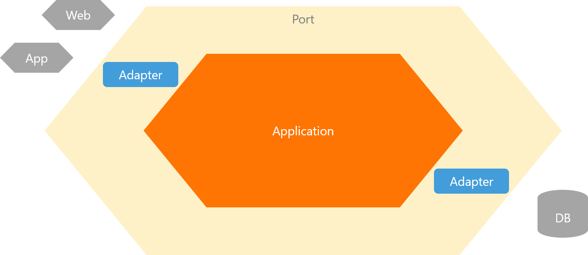

# ヘキサゴナルアーキテクチャ実装パターン



https://nrslib.com/hexagonal-architecture/ より画像引用

### 補足
- Primary port: Application層を「利用する」側
  - Web, UI, CLI, etc... 
- Secondary port: Applicationから「利用される」側
  - DB, API, etc...

## ディレクトリ構成

※ 図と照らし合わせられるように、あえて `port` というディレクトリを用意しているが、実際のPJT等では直接 `main.go` などから利用されることがほとんど。

```shell
├── adaptor
│   ├── datastore
│   │   ├── db.go
│   │   └── todo.go
│   └── web
│       ├── server.go
│       └── todo.go
├── application
│   └── todo.go
├── domain
│   ├── repository.go
│   └── todo.go
├── main.go
└── port
    └── executor
        └── executor.go
```
