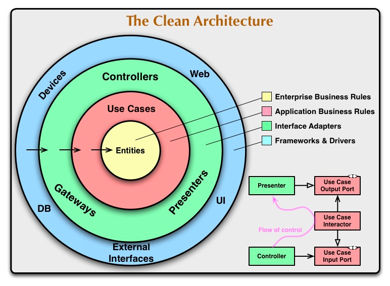

# クリーンアーキテクチャ実装パターン



https://blog.cleancoder.com/uncle-bob/2012/08/13/the-clean-architecture.html より画像引用

## ディレクトリ構造

※ 今回、あえて円の内側と外側とが分かりやすいような構成にしていますが、実際にはもう少し違ったディレクトリ構成で運用されているPJTが多いと思います。

```shell
├── external # 円の一番外側（Devices,Web,DB,UI,External Interfaces）
│   ├── infrastructure
│   │   ├── db.go
│   │   └── todo.go
│   └── presentation
│       └── httpserver
│           ├── server.go
│           └── todo.go
├── internal
│   ├── application # Use Cases
│   │   └── todo.go
│   ├── cmd # 円の外側から2番目（Controllers,Gateways,Presenters）
│   │   └── executor.go
│   └── domain # Entities
│       ├── repository.go
│       └── todo.go
└── main.go
```
