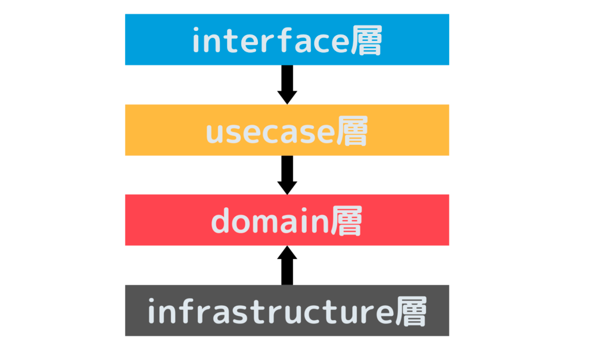

# レイヤードアーキテクチャ実装パターン



https://qiita.com/tozastation/items/a69a102fdc3f62d566b4 より画像引用

## ディレクトリ構成

```shell
├── domain # Domain層
│   └── todo.go
├── handler # UI(Presentation)層
│   └── todo.go
├── infra # Infrastructure層
│   ├── db.go
│   └── todo.go
├── main.go
└── usecase # Application層
    └── todo.go
```
